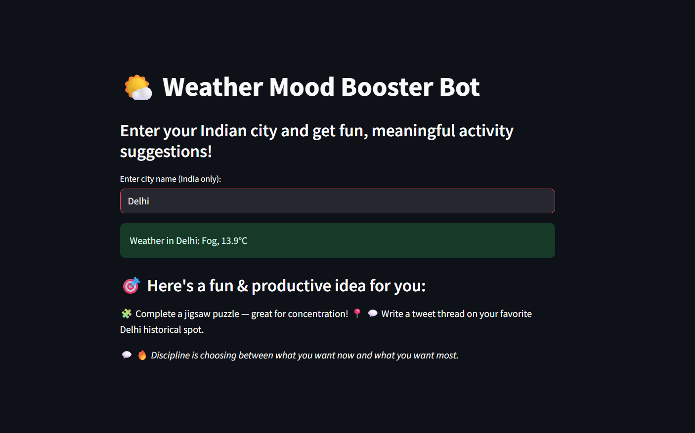

# A-Recommender-System-for-Mood-Boosting-Activities-Based-on-Real-Time-Weather-Data

## Overview

This project is a simple web-based recommender system that suggests mood-boosting activities based on real-time weather data. It fetches live weather information for a city entered by the user and uses predefined logic to recommend suitable activities.

## Problem Statement

People’s moods are often influenced by weather conditions, but there’s rarely a simple way to get activity suggestions based on how the weather feels. This system aims to address that gap.

## Proposed Solution
This project is designed to help people stay productive even on days when their mood is affected by the weather, which often leads to unproductive habits like endlessly scrolling through social media.
The solution as follows
- Collects real-time weather data using an API.
- Processes the weather to determine a "mood category."
- Recommends mood-enhancing activities accordingly.
- Suggests activities per weather condition that are:  
  - City-specific (Indian cities assumed)  
  - Fun, unique, and skill-building  
  - Non-harmful and mood uplifting  
- Built using Python and Streamlit for an easy-to-use interface.

## Technologies Used

- Python
- Streamlit
- OpenWeatherMap API

## Algorithm & Workflow

- **Algorithm Selection**  
  Rule-based logic maps weather conditions to activity types, prioritizing simplicity and responsiveness.

- **Input**  
  City name (text field in Streamlit).

- **Processing**  
  Calls weather API, fetches current condition → matches with mood logic dictionary → outputs activity list and a motivational quote.

- **Output**  
  Activities appear on the web interface with optional refreshing for new ideas.

## Sample Output 
The image below shows the output. After entering the city name (e.g., "Delhi"), the system fetches the real-time weather and suggests mood-boosting, productive activities tailored to the weather conditions. It helps to stay focused and positive, even on dull weather days.

